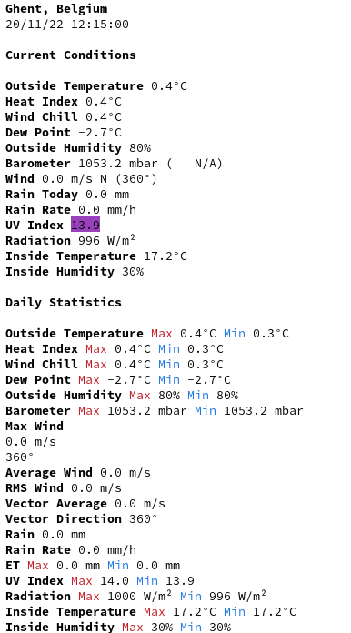

# WeeWX Console

A CLI-friendly skin for weewx. Inspired by [wttr.in](https://github.com/chubin/wttr.in).
Using this skin, you can query the status of your weather station using your favorite console HTTP client (curl, httpie, wget...).



## Installation

Clone the repo and run the installer:
```
wee_extension --install weewx-console
```

Restart weewx:
```
sudo systemctl restart weewx
```
